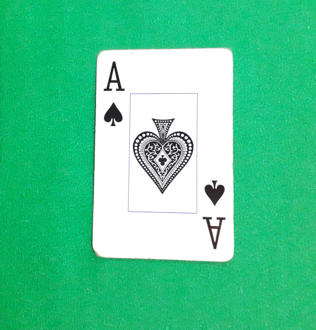
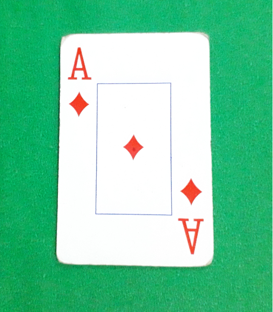
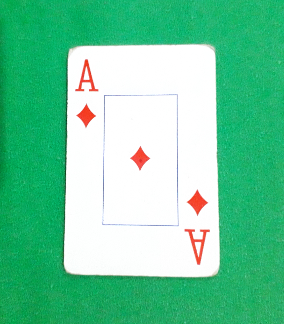

# SmartPoker
:zap: PDI - in build..

# Aquisição :iphone: :

 1 - Smartphone com câmera traseira [10 MP ou superior]
 
 2 - Iluminação natural.
 
 3 - Fundo verde.
 
 4 - Posicionar a carta no plano e individual na vertical.
 
 5 - Distanciar a câmera em média de 15 cm da imagem.
 

#Imagem de entrada:

  
  
  
  

 

#Imagem de saida:

  

