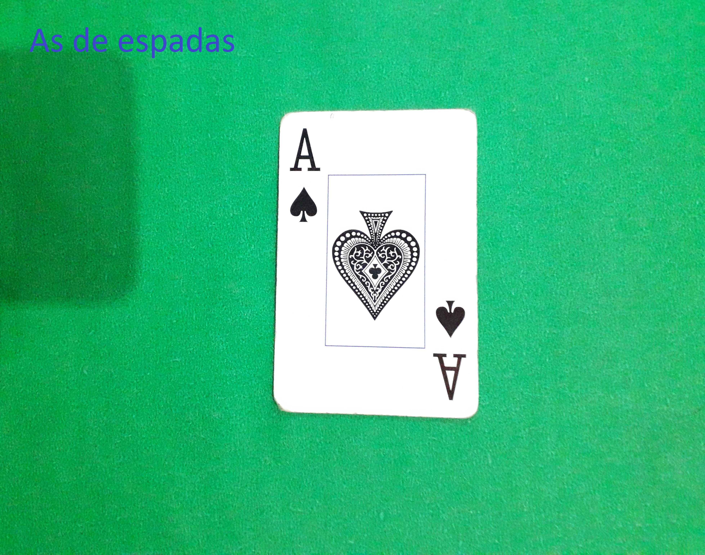

# SmartPoker
:zap: PDI - finish!!.

# Aquisição :iphone: pt-BR:

 1 - Smartphone com câmera traseira [10 MP ou superior]
 
 2 - Iluminação natural.
 
 3 - Fundo verde.
 
 4 - Posicionar a carta no plano e individual na vertical.
 
 5 - Distanciar a câmera em média de 15 cm da imagem.
 

#### Imagem de entrada:

  
  
  
  

 

#### Imagem de saida:

  

## 
# Acquisition - how to use:

1 - Use u smartphone that have cam 10 MP or superior.

2 - Natural lighting.

3 - Green background.

4 - Position the card vertically.

5 - Screenshot, but do with a distance of 15 cm from the image.

#### Input:

  
  
  
  

 

#### Output:

  

## Contribuintes
- [Lucas Gabriel](https://github.com/v0ltmx)
- [Davi Almeida](https://github.com/Sevnar)

## Licença

- [MIT](https://github.com/v0ltmx/SmartPoker/blob/master/LICENSE)
